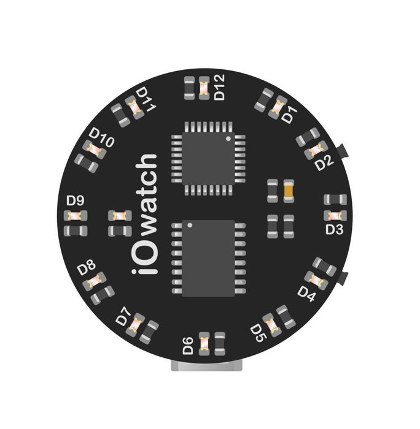
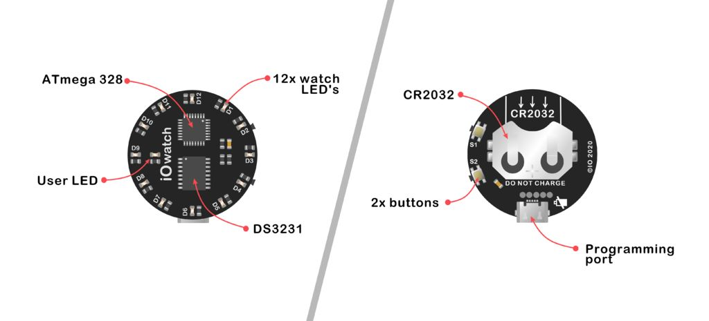
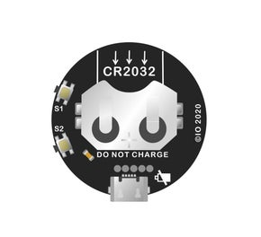
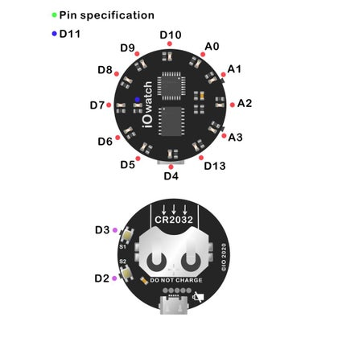

<h1 align="center"><b>IO Watch</b></h3>

## ⌨️ Collaborators
- Nasip Salmakhunov

## 🔗 Usefull links
- [Thingiverse]()

## Device Requirements
<h3>An overview of what components and tools were used in this build.</h3>

 - Microcontroller
  
The IC on this board is the ATMega328. 

  
 - Power system
  
The watch has a battery holder for a 3V, 20mm coin cell battery. Recommended 250mAh at 3V. 

  
 - Keeping the time
  
Size 0603 RED led's coupled with fairly high value (680 Ohm) resistors keeping the current low and still visible in direct sunlight. 

  
 - User interface
  
he finest RTC I can get is DS3231 keeping the time precise as it gets.  

  

## PCB - Schematics and Layout

#### PCB specifications

- Layers:2
- Dimension:35mm*35mm
- Thickness:0.8
- Impedance: no
- PCB Color: Black
- Surface Finish: HASL(with lead)
- Copper Weight:1 oz
- Gold Fingers: No
- Material Details: FR4-Standard Tg 130-140C
- Panel By JLCPCB: No
- Flying Probe Test: Fully
- Test Castellated Holes: no

 

## Programming

Using the FTDI test (connection) pads provided on the back of the PCB you can use a cheap FTDI converter to upload the code.

## 3D Modeling and Printing

verything except wrist watch band and glass - 3D prints, That includes

- Main body
- Outer Glass ring
- Bottom body
- Buttons
I used the following settings in Cura for my prints:

- 3D Printer - Prusa I3 MK3S
- Material: PLA
- Layer Height - 0.1 mm
- Shell Thickness - 0.8 mm (Nozzle: 0.4 - 2 Shells)
- Top and Bottom Thickness - 0.8mm
- Fill Density - 100%
- Filament - 1.75mm
- Support Type - Everywhere
- Platform adhesion Type - Skirt

